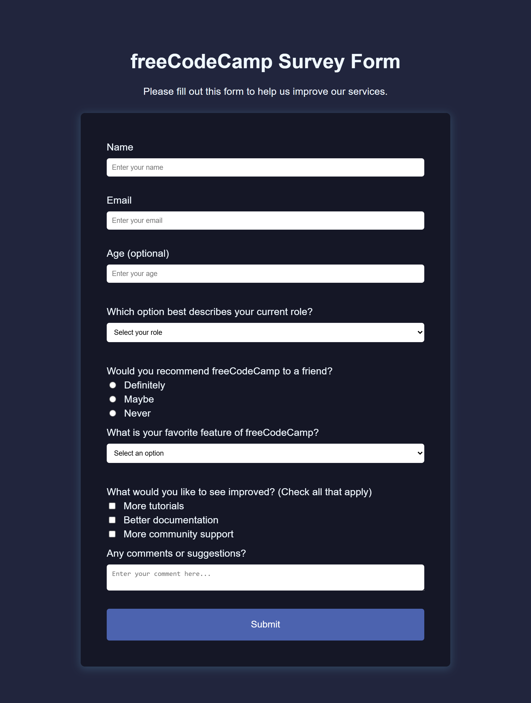

# FreeCodeCamp Survey Form

A responsive survey form project created as part of the **Responsive Web Design Certification** from FreeCodeCamp.

## 📖 About The Project

This project is a simple and responsive survey form built using HTML and CSS.  
The form is designed to collect user feedback and practice building accessible web forms with proper structure and styling.

The project includes:

- Text input fields
- Email and number validation
- Dropdown menu
- Radio buttons
- Checkboxes
- Textarea for comments
- Submit button

## 🚀 Features

- Responsive layout
- Clean user interface
- Semantic HTML5 structure
- Accessible form elements
- Mobile-friendly design

## 🛠️ Built With

- HTML5
- CSS3

## 🎯 Project Purpose

This project was built to complete the **Survey Form Certification Project** from FreeCodeCamp.

[FreeCodeCamp Responsive Web Design Certification](https://www.freecodecamp.org/learn/2022/responsive-web-design/)

## 📸 Preview



## 📂 Folder Structure

```bash
project-folder/
│
├── index.html
├── style.css
├── README.md
└── assets/
    └── preview.png
```

## 📚 What I Learned

Through this project, I practiced:

- Creating responsive forms
- Using different HTML input types
- Form validation
- CSS styling and layout
- Improving accessibility in forms

## ✨ Author

Created by **Fawwaz Musytaqul Umam**  
For the FreeCodeCamp Certification Project.